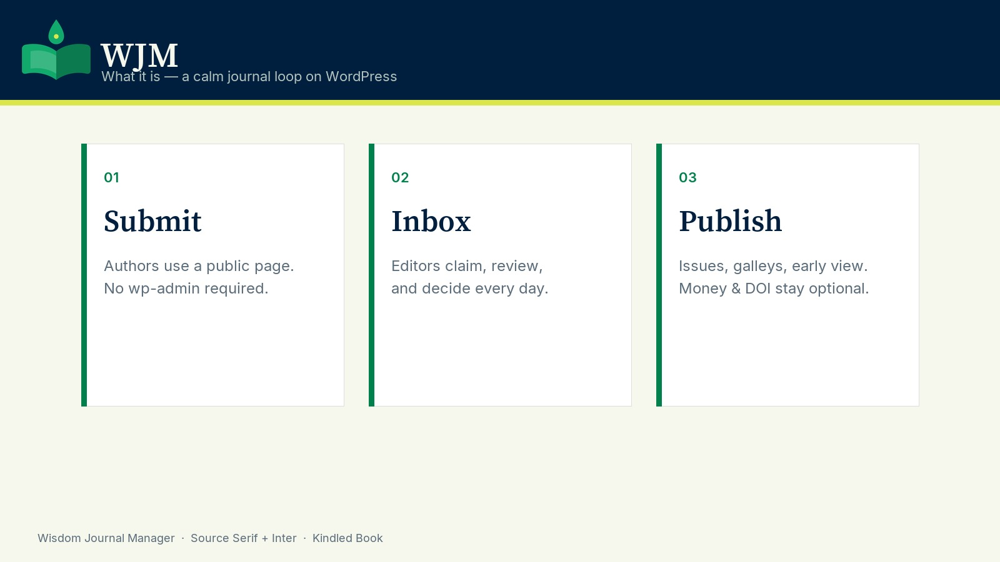
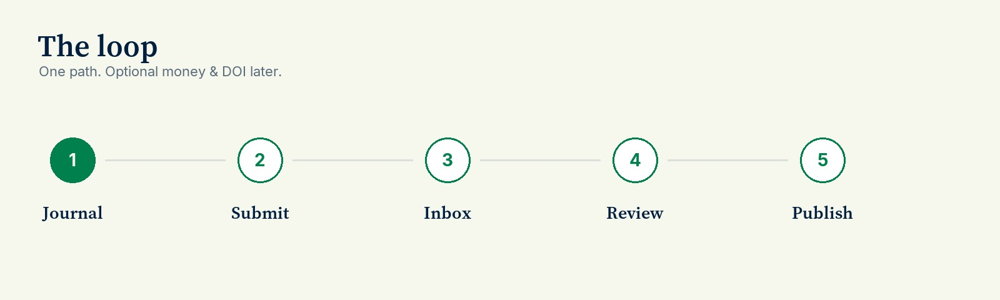
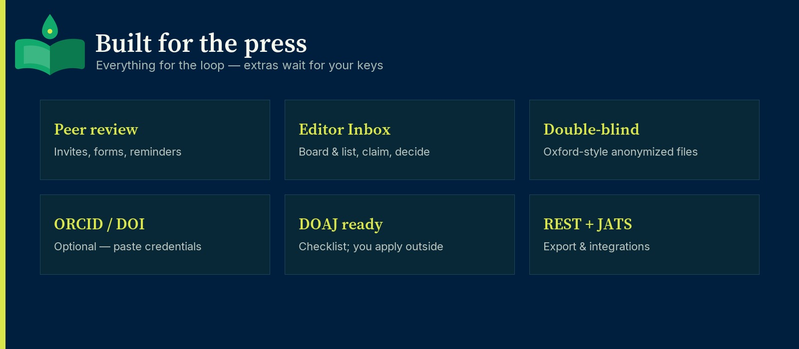
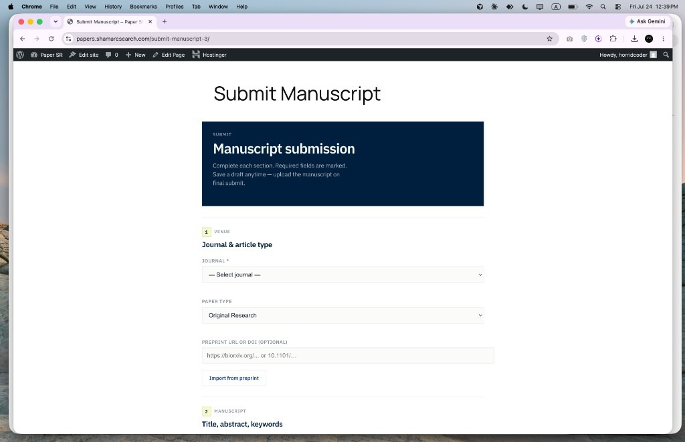

# Wisdom Journal Manager

**v1.0.0 — final**

Scholarly publishing for WordPress. Authors submit → editors work the Inbox → review → publish. Money, DOI, and Stripe stay optional until you add your own vendor accounts. DOAJ listing is applied outside the plugin. ORCID Public API is for lookup / connect — not Member write.

  

  

**Brand:** Kindled Book mark · **Wordmark:** Source Serif · **UI:** Inter · Bookish, editorial — a journal should feel like print, not a terminal.

---

## What it is

  

  

---

## Why it’s easy

| Day one | Later (optional) |
| --- | --- |
| Import demo → open Inbox → decide → publish | Stripe APC, Crossref/DataCite DOI, iThenticate |
| Public submit page (authors never need wp-admin) | ORCID Public API (lookup / connect) |
| Journals sidebar stays calm | DOAJ application on doaj.org |
| 3-minute Help inside Journals → Help | Double-blind Oxford-style file uploads |

**Remember the loop:** Authors submit → **Inbox** → review → publish.

  

---

## Screenshots

Live product UI from v1.0.0 — each screen once.

### 1 · Home — learn the journal loop

  

### 2 · Inbox — your daily page

  

### 3 · Help — three minutes

  

### 4 · Advanced — toolbox when you need it

  

### 5 · Author submit page

  

---

## Brand & WordPress.org assets

| Asset | Location |
| --- | --- |
| In-plugin logos (SVG + PNG) | `assets/brand/` |
| Promo / README graphics | `assets/promo/` |
| WordPress.org directory banners, icons, screenshots | Repo root [`.wordpress-org/`](../.wordpress-org/) |

WordPress.org upload checklist lives in [`.wordpress-org/README.txt`](../.wordpress-org/README.txt).

Colors: Midnight `#001F3F` · Book Green `#00804C` · Book Dark `#00603A` · Spring `#DBE64C` · Paper `#F6F7ED`

---

## Install

1. Upload `wisdom-journal-manager.zip` via **Plugins → Add New → Upload Plugin**
2. Activate **Wisdom Journal Manager**
3. You’ll land on **Journals → Home**
4. Click **Import demo (recommended)** — or create a blank journal
5. Open **Inbox**, try a sample paper, then share the author submit page

Requires **WordPress 5.0+**, **PHP 7.4+**.

---

## What’s included

### Core (works without vendor keys)

- Journals → Issues → Papers
- Public manuscript submission (+ drafts, co-authors, CRediT)
- Editor Inbox (board / list)
- Peer review invites, structured forms, reminders
- Decision letters, desk reject, editor-side appeals
- Double-blind file policy (Oxford-style anonymized + title page)
- Soft integrity heuristics (never auto-rejects)
- Shortcodes, REST API, minimal JATS export
- DOAJ **readiness checklist** (you still apply on doaj.org)
- ORCID Public API (lookup / connect / import works) — does **not** write peer-review credit

### Optional (paste your credentials to Enable)

| Feature | You provide |
| --- | --- |
| **Stripe** APC | Secret + publishable (+ webhook) — or Manual pay |
| **DOI** deposit | Prefix + Crossref / DataCite — or Local string-only |
| **iThenticate** | Tenant API base + key — or manual % |
| **ORCID** | Free Public API Client ID + Secret |
| **DOAJ listing** | Apply at [doaj.org/apply](https://doaj.org/apply/) |

### Honest limits

- No ORCID Member peer-review write API
- No Web of Science citation counts (use Crossref / Semantic Scholar / Scopus)
- Webhooks fire once (no retries); OAI is minimal `oai_dc`
- “Show paper extras” only adds meta boxes — Advanced menu is a separate toolbox

---

## Shortcodes

| Shortcode | Purpose |
| --- | --- |
| `[wjm_submit]` | Author submission form |
| `[wjm_my_submissions]` | Author’s papers |
| `[journals]` `[issues]` `[papers]` | Catalog lists |
| `[wjm_search]` | Search |
| `[wjm_paper_metrics]` | Paper metrics |
| `[wjm_author_profile]` | Author profile |

---

## REST API (selected)

Base: `/wp-json/wjm/v1/`

- `GET /journals` · `GET /papers` · `GET /papers/{id}`
- `POST /papers/{id}/status` · `GET /stats`

---

## Support & license

- **Author:** Zachary Adam — [aethexweb.com](https://aethexweb.com)  
- **WordPress.org contributor:** [aethex](https://profiles.wordpress.org/aethex/)  
- **Plugin URI:** [github.com/aethex/wisdom-journal-manager](https://github.com/aethex/wisdom-journal-manager)  
- **License:** GPL-2.0-or-later  

---

## Changelog (1.0.0)

Final ship: calm Home / Help learn path, Kindled Book brand (Source Serif + Inter), Inbox, peer review, submissions, credential-gated Stripe / DOI / iThenticate, ORCID Public API, DOAJ checklist, shortcodes, REST, minimal JATS. Honest limits documented (no ORCID Member write, no WoS citation counts). WordPress.org banners, icons, and screenshots in `.wordpress-org/`.
