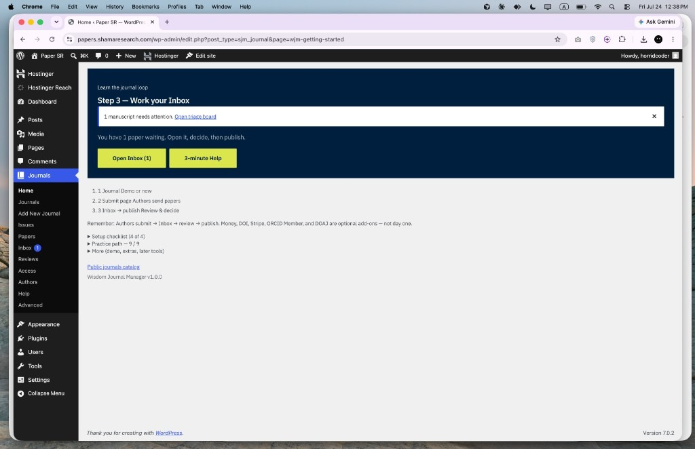
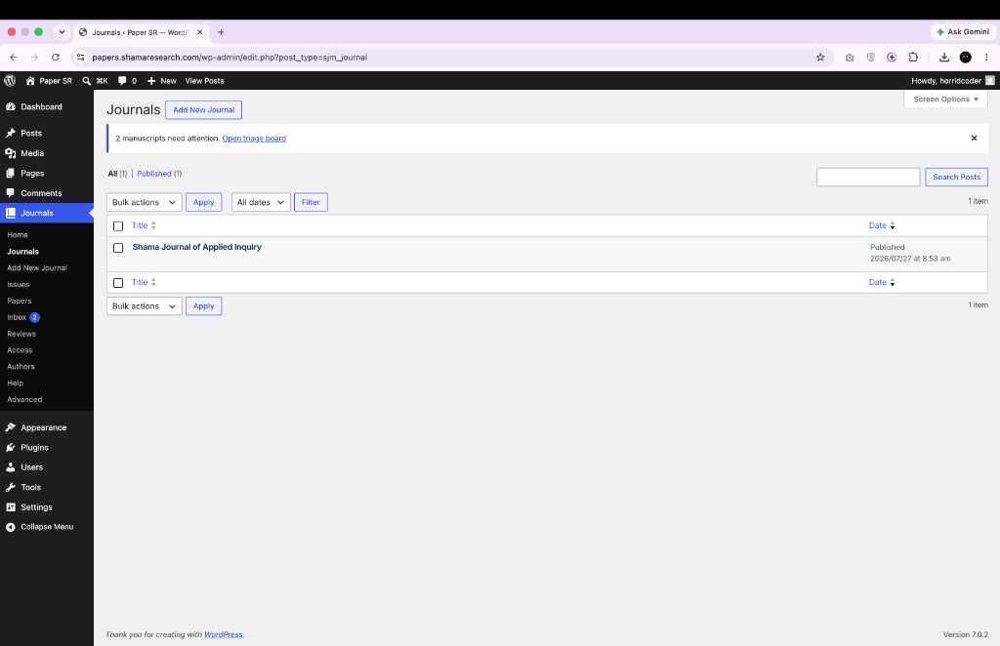
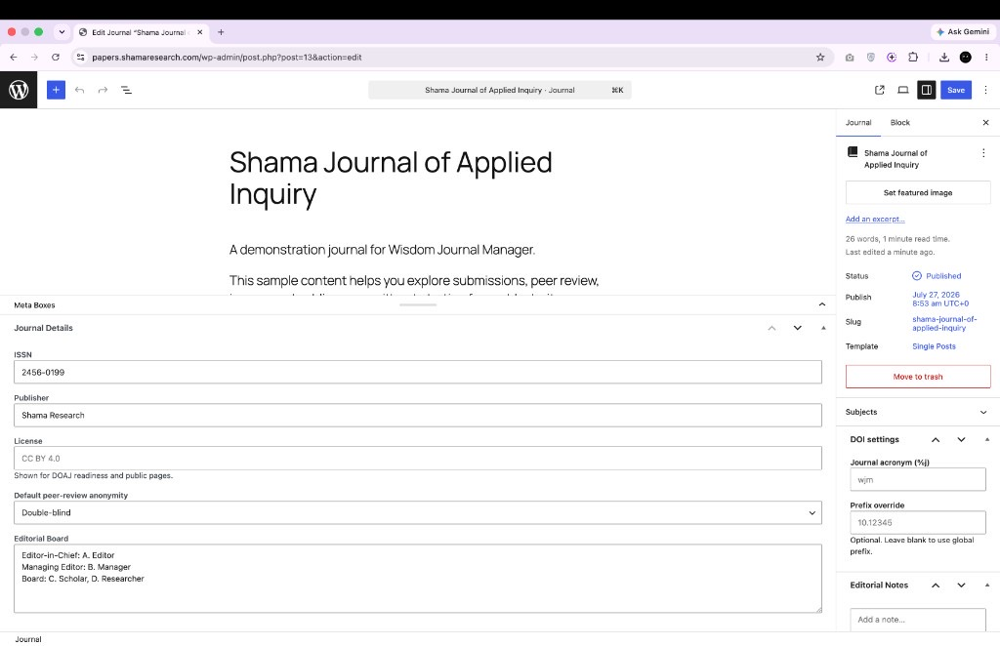
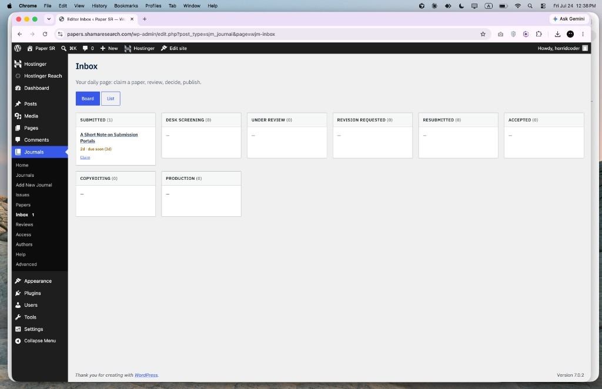
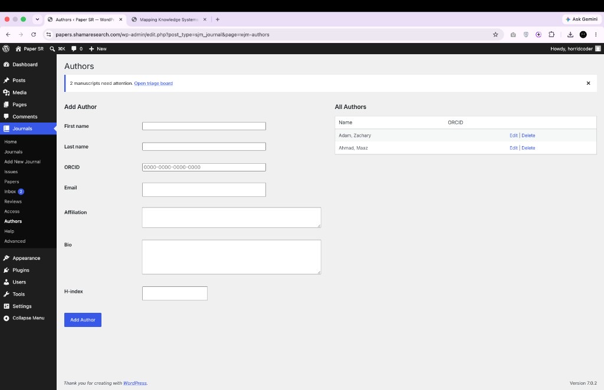
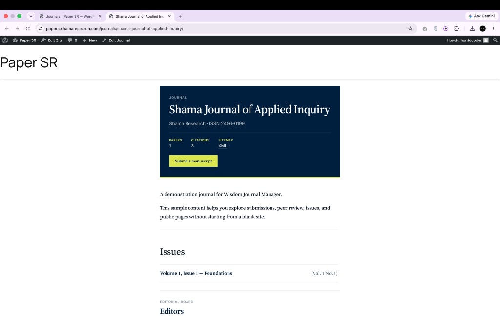
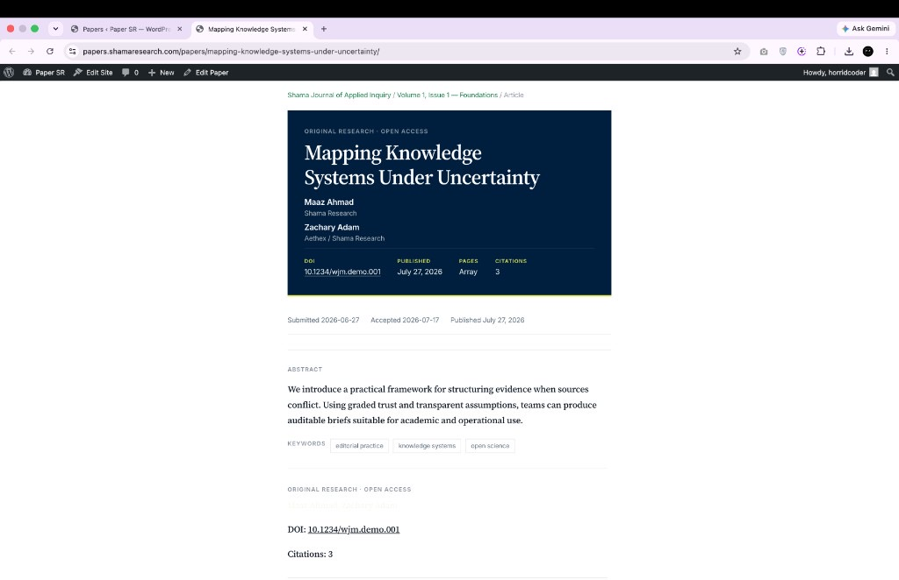
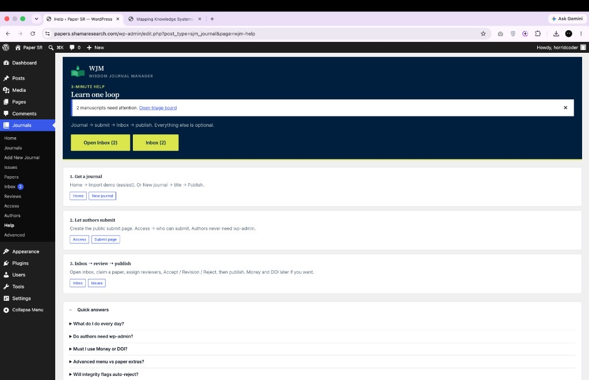
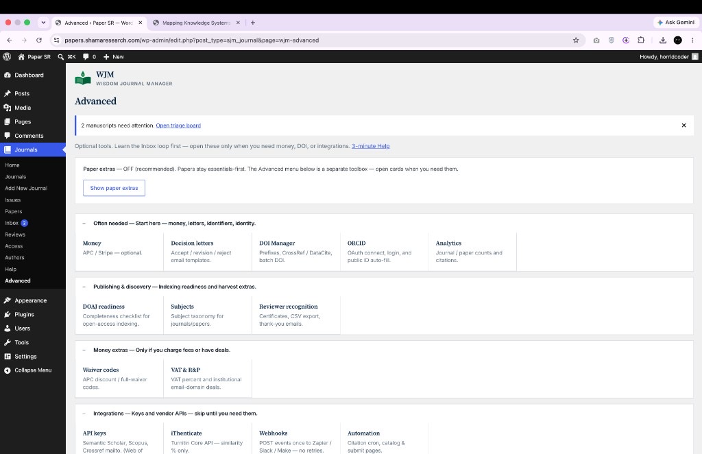
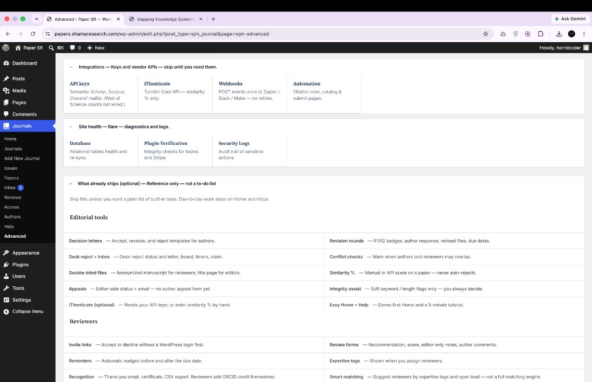

# Wisdom Journal Manager (WJM)

**Free open-source WordPress journal software** for small scholarly boards.

**Authors submit → editors work the Inbox → review → publish.**

## Get the Plugin

📦 **[Install from the WordPress Plugin Directory](https://wordpress.org/plugins/wisdom-journal-manager/)**

This repo is the development source. For the stable, WordPress.org-reviewed release, install directly from the link above.

No ScholarOne. No WordPress login for authors. Stripe, DOI, and ORCID stay optional.

  

**Product site:** [shamaresearch.com/wjm](https://shamaresearch.com/wjm/) · **Screenshots:** [Tour](https://shamaresearch.com/wjm/tour.html) · **Guide:** [Install](https://shamaresearch.com/wjm/help.html) · **Author:** Zachary Adam / Shama Research

**Research paper:** [SSRN](https://papers.ssrn.com/sol3/papers.cfm?abstract_id=6387618) · [ResearchGate](https://www.researchgate.net/publication/401792979_WJM_A_Modular_WordPress_Architecture_for_Scalable_Academic_Publishing_Infrastructure)

---

## Example

A campus nursing journal already runs on WordPress. Three faculty edit. Students used to email PDFs.

With WJM: student opens the public submit page → editor claims the paper in **Inbox** → reviewer gets an invite link → accept → publish. Readers see the paper on the journal site. No Stripe on day one.

Also fits: society newsletters with peer review, department working-paper series, student research magazines.

---

## The loop

| Step | What happens |
| --- | --- |
| **Submit** | Authors use a public form. No wp-admin account. |
| **Inbox** | Editors claim papers, send to review, decide. |
| **Publish** | Issues and papers go live on the front end. |

Open **Advanced** only when you need Stripe, DOI, ORCID, or integrations.

---

## Screenshots

### Home

  

### Journals list

  

### Journal settings

  

### Inbox

  

### Authors

  

### Public journal

  

### Paper page

  

### Help

  

### Advanced

  

### Advanced · more

  

---

## Install

1. Upload the plugin zip via **Plugins → Add New → Upload Plugin**
2. Activate **Wisdom Journal Manager**
3. Open **Journals → Home**
4. Click **Import demo** (recommended)
5. Open **Inbox**, then share the author submit page

Requires **WordPress 5.0+**, **PHP 7.4+**.

Full guide: [shamaresearch.com/wjm/help.html](https://shamaresearch.com/wjm/help.html)

---

## FAQ

**Do authors need a WordPress account?** No: public submit page.

**Is WJM free?** Yes: GPL-2.0-or-later. No WJM license fee.

**Do I need Stripe or DOI to start?** No.

**Is this ScholarOne or OJS?** No. Built for small WordPress boards, not enterprise parity.

---

## What ships without vendor keys

- Journals → Issues → Papers
- Public manuscript submission
- Editor Inbox (board / list)
- Peer review invites and forms
- Decision letters
- Double-blind file policy
- Help inside the plugin

## Optional (your own keys)

- Stripe APC
- Crossref / DataCite DOI
- ORCID Public API (lookup / connect: not Member write)
- iThenticate similarity %
- DOAJ readiness checklist (you still apply on doaj.org)

Honest limits: [shamaresearch.com/wjm/limits.html](https://shamaresearch.com/wjm/limits.html)

---

## Brand

Kindled Book · Midnight `#001F3F` · Book Green `#00804C` · Spring `#DBE64C` · Paper `#F6F7ED`

---

## License

GPL-2.0-or-later
